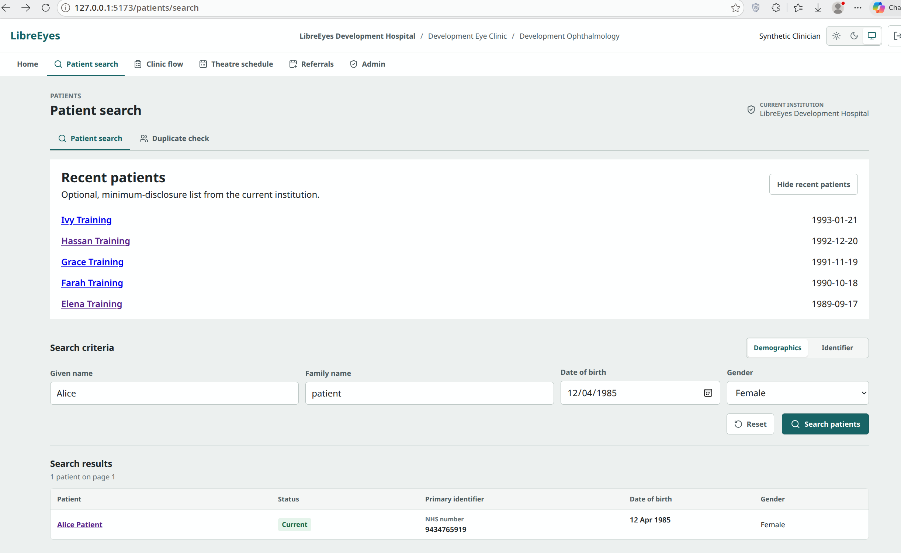
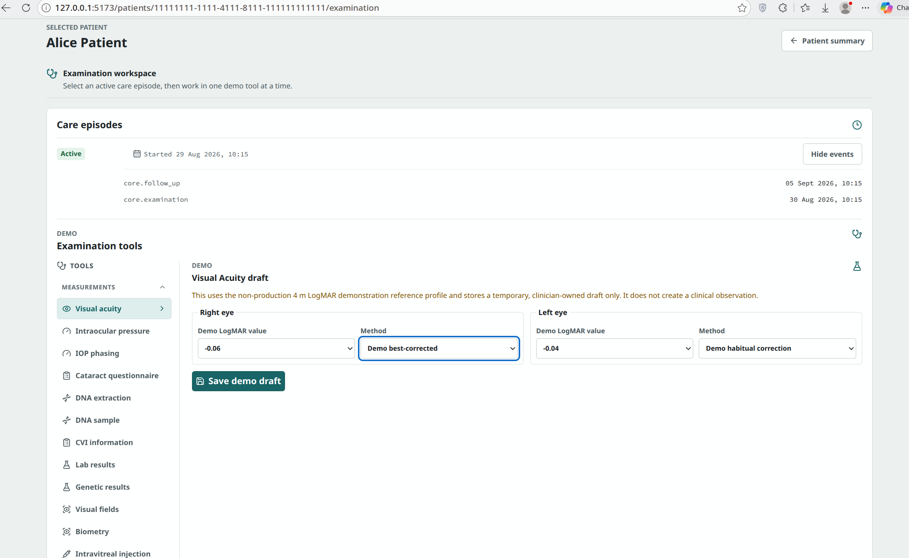
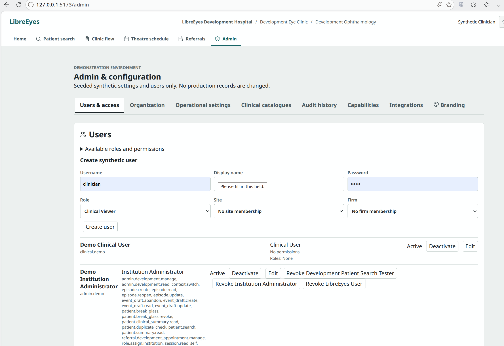

# LibreEyes Clinical Workflow Demonstration

This guide outlines the core clinical and operational workflows available in the LibreEyes synthetic demonstration release. The user journeys reflect contemporary British ophthalmic and NHS hospital eye service practices, adapted from the clinical principles of OpenEyes.

> [!NOTE]
> All records, patient names, NHS numbers, and clinical observations depicted below are entirely synthetic. They are intended solely for software demonstration and user journey evaluation.

---

## Table of Contents

1. [Demonstration Credentials and User Account Setup](#1-demonstration-credentials-and-user-account-setup)
2. [Patient Identification and Demographic Search](#2-patient-identification-and-demographic-search)
3. [Ophthalmic Examination Workspace](#3-ophthalmic-examination-workspace)
4. [Administration and Institutional Access Governance](#4-administration-and-institutional-access-governance)
5. [Additional Clinical Modules](#5-additional-clinical-modules)

---

## 1. Demonstration Credentials and User Account Setup

### Default Pre-seeded Credentials

To test and evaluate the application immediately without preliminary configuration, sign in using the pre-seeded demonstration clinician account:

* **Login URL**: `http://localhost:10000/login` (Docker/Podman Compose) or `http://localhost:5173/login` (source launcher)
* **Default Username**: `clinician`
* **Default Password**: `123456`
* **Role**: Synthetic Clinician (provisioned with comprehensive clinical demonstration permissions)

> [!IMPORTANT]
> The default credentials are fixed for synthetic demonstration purposes only. Never use them in production or with real clinical data.

### Setting Up Custom User Accounts

You can configure and use custom accounts using either of the following two methods:

#### Method A: Provisioning Custom Users via the Admin Console (In-App)
Any user with administrative access can dynamically create additional clinicians and administrative personnel directly in the web user interface:

1. Sign in using the default `clinician` / `123456` account.
2. Click **Admin** in the primary navigation bar.
3. Select the **Users & access** tab.
4. Locate the **Create synthetic user** form:
   * **Username**: Enter the desired username (e.g. `dr.smith`).
   * **Display name**: Enter the full clinical name (e.g. `Dr Eleanor Smith`).
   * **Password**: Choose a custom password.
   * **Role**: Select the appropriate permission profile from the drop-down (e.g. `Clinical User`, `Clinical Viewer`, or `Institution Administrator`).
   * **Site** and **Firm**: Allocate hospital site and ophthalmic sub-specialty firm memberships.
5. Click **Create user**.
6. Sign out using the exit icon in the upper-right corner, then log in using your newly created credentials.

#### Method B: Specifying Custom Credentials Before Launch (CLI / Environment Variables)
If launching from source via `demo.sh`, you can specify your own custom credentials in your terminal prior to running the script:

```bash
export LIBREEYES_DEV_USERNAME="dr.smith"
export LIBREEYES_DEV_DISPLAY_NAME="Dr Eleanor Smith"
export LIBREEYES_DEV_PASSWORD="MyCustomPassword123!"
./demo.sh
```

When deploying via Compose (`compose.yaml`), you can similarly set `LIBREEYES_DEV_USERNAME`, `LIBREEYES_DEV_DISPLAY_NAME`, and `LIBREEYES_DEV_PASSWORD` in the `seed` service definition or via a local `.env` file.

---

## 2. Patient Identification and Demographic Search

The patient search interface provides secure, tenant-scoped patient lookup adhering to the principle of minimum data disclosure. Clinicians can locate patients either by demographic details or by unique health identifiers.



### Key Features

* **Demographic Search**: Enables querying by combinations of given name, family name, date of birth, and gender.
* **Identifier Lookup**: Direct query support for primary identifiers, such as the 10-digit NHS number or hospital unit record numbers.
* **Minimum-Disclosure Policy**: Prevents broad browsing of patient lists; specific search criteria must be supplied before matching records are revealed.
* **Recent Patients Shortcut**: An optional, quickly accessible history panel listing recently reviewed synthetic records within the current hospital trust or clinic site.
* **Duplicate Checking**: Built-in validation mechanisms to flag potential duplicate identities prior to episode creation.

### Step-by-Step Workflow

1. Select **Patient search** in the primary navigation header.
2. In the **Search criteria** section, input the patient's demographic information (for example, Given name: `Alice`, Family name: `Patient`, Date of birth: `12/04/1985`, Gender: `Female`).
3. Click **Search patients**.
4. Review the matching results under **Search results** (e.g., *Alice Patient*, NHS Number: `9434765919`, Status: `Current`).
5. Click on the patient record to open their longitudinal clinical summary and care episodes.

---

## 3. Ophthalmic Examination Workspace

Once a patient is selected, clinicians can review active care episodes and launch structured examination modules. The workspace centralises clinical visit history and provides specialised ophthalmic testing tools.



### Key Features

* **Care Episode Timeline**: Chronologically tracks patient encounters, including initial consultations, examination events (`core.examination`), and scheduled follow-ups (`core.follow_up`).
* **Modular Examination Toolkit**: A dedicated sidebar categorising ophthalmic tools into measurements, clinical drawings, diagnostic questionnaires, and laboratory tests:
  * **Measurements**: Visual acuity (LogMAR/Snellen), Intraocular Pressure (IOP), IOP Phasing, and Biometry.
  * **Clinical Questionnaires**: Validated instruments including Cat-PROM (Cataract Patient-Reported Outcome Measures).
  * **Specialist Assessments**: Visual fields, CVI (Certificate of Vision Impairment) documentation, DNA extraction, and genetic analysis.
* **Standardised Visual Acuity Recording**: Facilitates bilateral 4-metre LogMAR assessment with explicit test method categorisation (e.g., best-corrected vs habitual correction).
* **Draft State Isolation**: Observations are saved as clinician-owned drafts before formal sign-off, preventing incomplete or transient entries from polluting the permanent clinical record.

### Step-by-Step Workflow

1. From the patient overview, select the active care episode and open the **Examination workspace**.
2. Inspect the **Care episodes** timeline to review previous clinical attendance history and notes.
3. From the **Examination tools** navigation on the left, select **Visual acuity**.
4. In the measurement form, record the bilateral findings:
   * **Right eye**: Specify the LogMAR value (e.g., `-0.06`) and the assessment method (e.g., `Demo best-corrected`).
   * **Left eye**: Specify the LogMAR value (e.g., `-0.04`) and the assessment method (e.g., `Demo habitual correction`).
5. Click **Save demo draft** to store the measurement securely within the active care episode draft.

---

## 4. Administration and Institutional Access Governance

LibreEyes provides multi-tenant administration tools to configure hospital sites, manage clinical firms, define roles, and audit system activities.



### Key Features

* **Tenant and Institutional Scope**: Configuration is bound to the logged-in trust or clinic (e.g., *LibreEyes Development Hospital / Development Eye Clinic*).
* **Role-Based Access Control (RBAC)**: Fine-grained permission assignments across clinical and administrative personas (e.g., `Clinical Viewer`, `Clinical User`, `Institution Administrator`, `Development Patient Search Tester`).
* **Synthetic User Provisioning**: Enables rapid onboarding of synthetic test clinicians with predefined role profiles, clinical site memberships, and firm affiliations.
* **Permission Transparency**: Direct visibility into explicit operational permissions (e.g., `admin.development.manage`, `context.switch`, `episode.create`, `patient.break_glass`).
* **Governance Tabs**: Fast navigation between Organisation hierarchy, Operational settings, Clinical catalogues, Audit history, System capabilities, Integrations, and Hospital branding.

### Step-by-Step Workflow

1. Navigate to **Admin** via the main navigation bar.
2. Ensure the **Users & access** tab is selected.
3. To inspect permission boundaries, expand **Available roles and permissions**.
4. To provision a test clinician:
   * Enter the **Username**, **Display name**, and temporary **Password**.
   * Select a clinical **Role** (such as `Clinical Viewer` or `Clinical User`).
   * Select the appropriate **Site** and **Firm** memberships from the drop-down menus.
   * Click **Create user**.
5. To modify existing users, use the **Deactivate**, **Edit**, or **Revoke** action buttons adjacent to each account entry.

---

## 5. Additional Clinical Modules

In addition to patient searches and examination drafts, the primary navigation bar provides access to:

* **Clinic Flow**: Real-time tracking of patient arrival, waiting times, triage, and clinician consultation stages within outpatient eye suites.
* **Theatre Schedule**: Surgical list management, operative session bookings, surgeon allocations, and procedure consent tracking.
* **Referrals**: Inbound electronic referral triage, urgency grading, and appointment scheduling across sub-specialty clinics.
